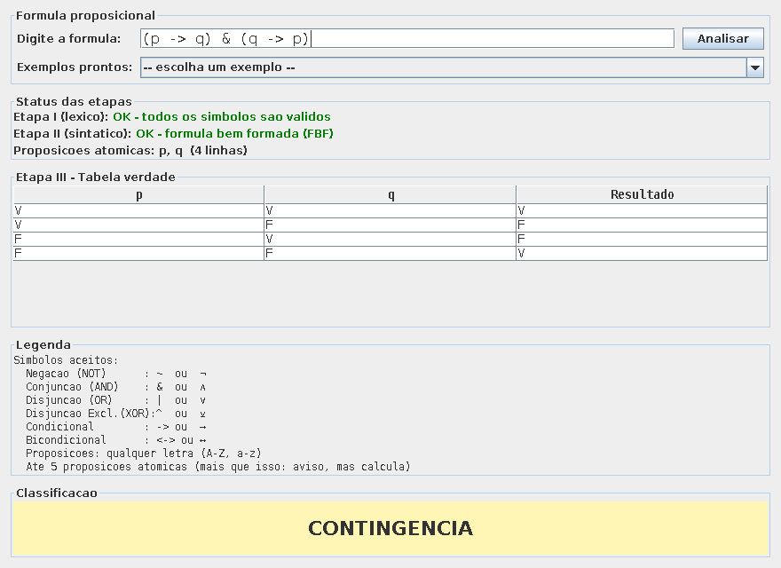

# Provador de Fórmulas Proposicionais — Projeto Watson (IBM)

**[🇧🇷 Português](#-português)** | **[🇺🇸 English](#-english)**



---

## 🇧🇷 Português

Programa em Java que recebe uma fórmula de lógica proposicional, verifica se ela é válida e gera a tabela verdade completa, classificando o resultado em **tautologia**, **contradição** ou **contingência**.

Trabalho da disciplina **T162 — Resolução de Problemas de Natureza Discreta**, Ciência da Computação, UNIFOR.

### O cenário

A IBM contratou nossa equipe para desenvolver um módulo para o Watson: um provador de fórmulas proposicionais. O projeto foi dividido em três etapas, cada uma construída em cima da anterior.

### Como funciona

| Etapa | Classe principal | O que faz |
|---|---|---|
| I — Léxica | `AnalisadorLexico` | Lê a fórmula caractere a caractere e verifica se cada símbolo é válido |
| II — Sintática | `AnalisadorSintatico` | Verifica se a fórmula é bem formada (FBF) e monta a árvore sintática |
| III — Provador | `MotorProvador` | Testa todas as combinações de V/F das proposições e monta a tabela verdade |

### Símbolos aceitos

| Conectivo | ASCII | Unicode | Significado |
|---|:---:|:---:|---|
| Negação (NOT) | `~` | `¬` | não p |
| Conjunção (AND) | `&` | `∧` | p e q |
| Disjunção (OR) | `\|` | `∨` | p ou q |
| Disjunção Exclusiva (XOR) | `^` | `⊻` | ou p ou q, não os dois |
| Condicional | `->` | `→` | se p então q |
| Bicondicional | `<->` | `↔` | p se e somente se q |

Proposições atômicas: qualquer letra (A–Z, a–z). Parênteses: `( )`. Até 5 proposições é o combinado — acima disso o programa avisa, mas calcula do mesmo jeito.

### Como compilar e rodar

```bash
javac -encoding UTF-8 *.java
java InterfaceGrafica
```

O `-encoding UTF-8` é necessário porque o código usa símbolos como `∧ ∨ → ↔` nos comentários e textos.

### Estrutura do código

```
Token.java                    - unidade léxica reconhecida (Etapa I)
AnalisadorLexico.java         - Etapa I: lê a fórmula e gera tokens
FormulaInvalidaException.java - erro de "não é FBF" (Etapa II)
AnalisadorSintatico.java      - Etapa II: monta a árvore / valida FBF
NoFormula.java                - classe abstrata da árvore sintática
NoBinario.java                - base dos conectivos de 2 operandos
Proposicao.java                - nó-folha (uma proposição atômica)
Negacao.java                   - conectivo unário ~
Conjuncao.java, Disjuncao.java, Xor.java,
Condicional.java, Bicondicional.java - um conectivo binário cada
TabelaValores.java              - valores V/F de uma linha da tabela
MotorProvador.java              - Etapa III: roda tudo e monta a tabela
ResultadoAnalise.java           - "pacote" com o resultado de uma análise
InterfaceGrafica.java           - janela do programa (ponto de entrada)
```

A lógica de cálculo (`MotorProvador`) é totalmente separada da exibição (`InterfaceGrafica`): o motor só calcula e devolve um `ResultadoAnalise`, e a interface só desenha o que recebeu.

### Nota sobre o método de Tableaux

O enunciado da atividade pede um provador baseado no teorema de Tableaux. Esta implementação usa enumeração completa de todas as interpretações possíveis (a tabela verdade tradicional), que produz o mesmo resultado final que um tableau semântico totalmente expandido produziria — cada linha da tabela equivale a um ramo do tableau — mas sem desenhar a árvore com as regras de expansão passo a passo.

---

## 🇺🇸 English

A Java program that takes a propositional logic formula, checks whether it is well-formed, and generates the complete truth table, classifying the result as a **tautology**, **contradiction**, or **contingency**.

Coursework for **T162 — Discrete Problem Solving**, Computer Science, UNIFOR (Brazil).

### The scenario

IBM hired our team to build a module for Watson: a propositional formula prover. The project was split into three stages, each one building on the previous.

### How it works

| Stage | Main class | What it does |
|---|---|---|
| I — Lexical | `AnalisadorLexico` | Reads the formula character by character and checks whether each symbol is valid |
| II — Syntactic | `AnalisadorSintatico` | Checks whether the formula is well-formed (WFF) and builds the syntax tree |
| III — Prover | `MotorProvador` | Tests every V/F combination of the propositions and builds the truth table |

### Accepted symbols

| Connective | ASCII | Unicode | Meaning |
|---|:---:|:---:|---|
| Negation (NOT) | `~` | `¬` | not p |
| Conjunction (AND) | `&` | `∧` | p and q |
| Disjunction (OR) | `\|` | `∨` | p or q |
| Exclusive Disjunction (XOR) | `^` | `⊻` | either p or q, not both |
| Conditional | `->` | `→` | if p then q |
| Biconditional | `<->` | `↔` | p if and only if q |

Atomic propositions: any letter (A–Z, a–z). Parentheses: `( )`. Up to 5 propositions is the agreed limit — above that the program warns but still computes normally.

### How to build and run

```bash
javac -encoding UTF-8 *.java
java InterfaceGrafica
```

The `-encoding UTF-8` flag is required because the source contains symbols such as `∧ ∨ → ↔` in comments and strings.

### Code structure

```
Token.java                    - a recognized lexical unit (Stage I)
AnalisadorLexico.java         - Stage I: reads the formula and produces tokens
FormulaInvalidaException.java - "not a WFF" error (Stage II)
AnalisadorSintatico.java      - Stage II: builds the tree / validates the WFF
NoFormula.java                - abstract base class of the syntax tree
NoBinario.java                - base class for two-operand connectives
Proposicao.java                - leaf node (a single atomic proposition)
Negacao.java                   - unary connective ~
Conjuncao.java, Disjuncao.java, Xor.java,
Condicional.java, Bicondicional.java - one binary connective each
TabelaValores.java              - V/F values for one row of the table
MotorProvador.java              - Stage III: runs everything and builds the table
ResultadoAnalise.java           - "package" carrying the result of one analysis
InterfaceGrafica.java           - the program's window (entry point)
```

The calculation logic (`MotorProvador`) is fully decoupled from the display (`InterfaceGrafica`): the engine only computes and returns a `ResultadoAnalise`, and the UI only renders whatever it received.

### A note on the Tableaux method

The assignment asks for a prover "based on the Tableaux theorem." This implementation uses full enumeration of every possible interpretation (the traditional truth table), which yields the same final result a fully expanded semantic tableau would produce — each row of the table corresponds to one branch of the tableau — but it does not draw the tree itself with its step-by-step expansion rules.
